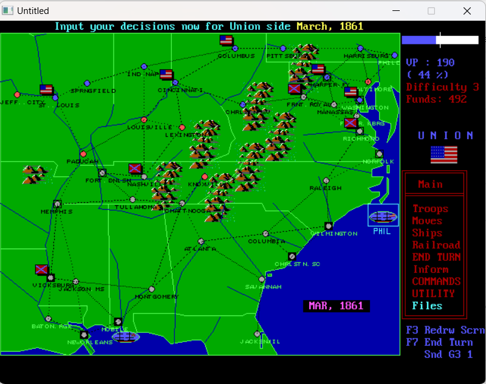

# W.R. Hutsell's Civil War Strategy Game

## Overview
A strategic level, turn-based one or two player wargame simulating the American Civil War (1861-1865).

## Contributing
Please see the [CONTRIBUTING.md](dev/CONTRIBUTING.md) file for instructions on how you can contribute improvements and bug fixes for this game.

## Branches
The `main` branch is the most recent version of the game that seems stable.

The `canonical-source` branch is the original source code as provided by W.R. Hutsell to Dave Mackey. This branch should never be modified.

The `minimal-changes` branch has the minimal changes required to run the game in QB64. It should only be modified if bugs related to the translation from QB to QB64 are discovered and fixed.

## Licensing
The Civil War Strategy Game is under the [permissive MIT license](../LICENSE). Some additional considerations based on the use of the QB64 compiler are outlined in [CWSTRAT.exe.license.txt](../CWSTRAT.exe.license.txt).